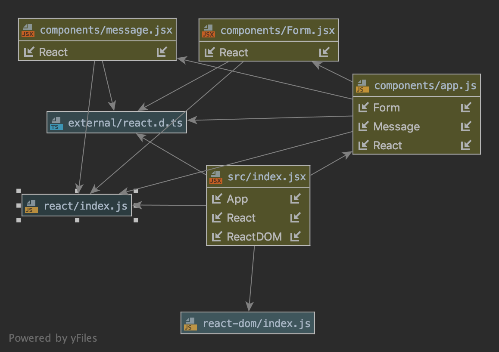

# LAB - 28

## Props and State

### Author: Lillian Gales

### Links and Resources
* [Assignment 1 - Props Practice](https://codesandbox.io/s/28-starter-code-props-uv9g5)
* [Assignment 2 - Internal State Practice](https://codesandbox.io/embed/28-starter-code-internal-state-2s5oy)
* [Assignment 3 - External State Practice](https://codesandbox.io/embed/28-starter-code-external-state-1itqi)

* [aws](http://lillian-gales-lab28.s3-website-us-west-2.amazonaws.com/)

### Modules
* app.js
* index.js
* message.js

#### Tests
* npm run test

#### UML

